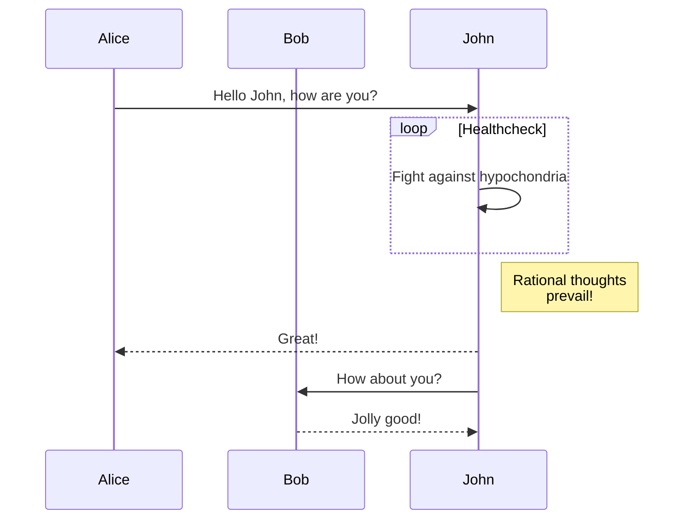

## Features

### [Light](https://wallpants.github.io/pantsdown/light.html#features) and [Dark](https://wallpants.github.io/pantsdown/index.html#features) modes

---

### Lists

- Ordered
  1. Item 1
  2. Item 2
- Unordered
  - Item 1
  - Item 2
- Tasks
  - [x] Item 1
  - [ ] Item 2

---

### Images


---

### Tables

| Syntax    | Description |
| --------- | ----------- |
| Header    | Title       |
| Paragraph | Text        |

---

### Code Highlight & Copy to Clipboard Button

[Supported languages](https://highlightjs.readthedocs.io/en/latest/supported-languages.html).

---

### Header Slugs

Jump to [#images](#images)

---

### Alerts

> [!NOTE]
> Highlights information that users should take into account, even when skimming.

> [!TIP]
> Optional information to help a user be more successful.

> [!IMPORTANT]
> Crucial information necessary for users to succeed.

> [!WARNING]
> Critical content demanding immediate user attention due to potential risks.

> [!CAUTION]
> Negative potential consequences of an action.

---

### \<details>

<details>
    <summary>
        <code>Summary</code>
    </summary>

>

Some content:

```sh
echo "hello world"
```

</details>

---

### Footnotes

Here's a simple footnote,[^1] and here's a longer one.[^bignote]

[^1]: This is the first footnote.
[^bignote]:
    Here's one with multiple paragraphs and code.
    Indent paragraphs to include them in the footnote.
    `{ my code }`
    Add as many paragraphs as you like.

---

### Mermaid

Take a look at [how Pantsdown's demo is built](https://github.com/wallpants/pantsdown/blob/main/docs/build.ts)
for an example setup.

````

````


